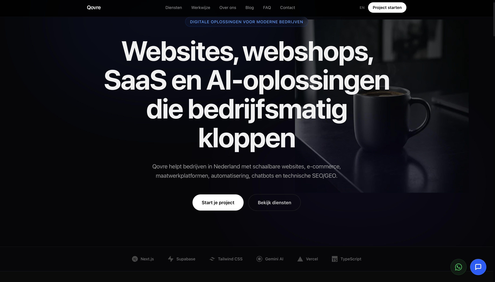
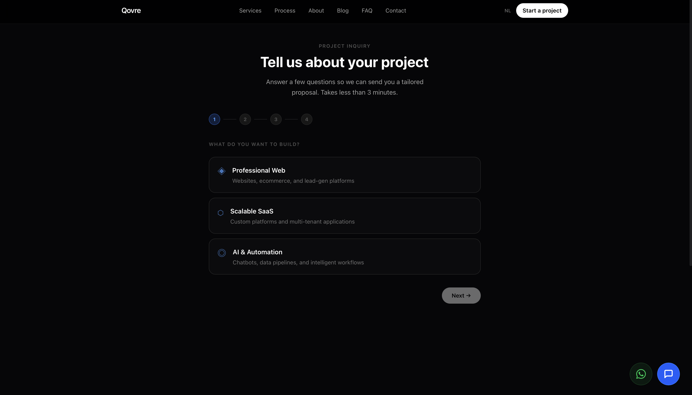
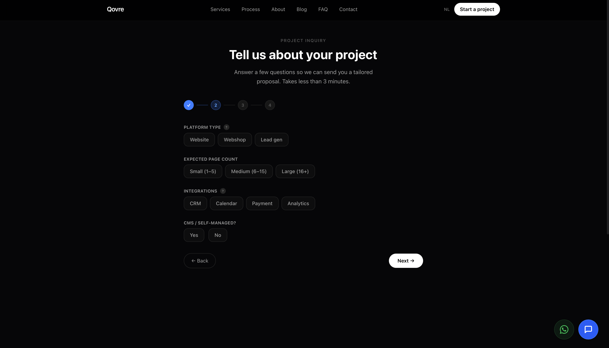
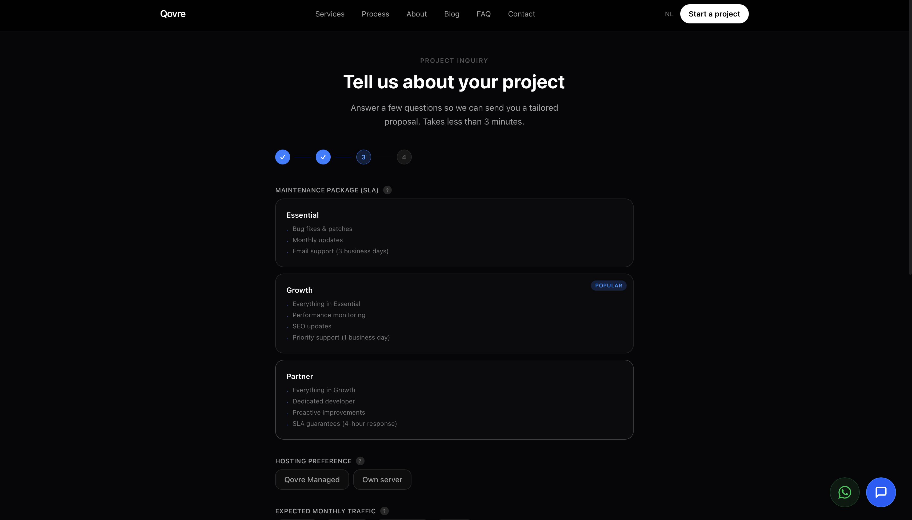
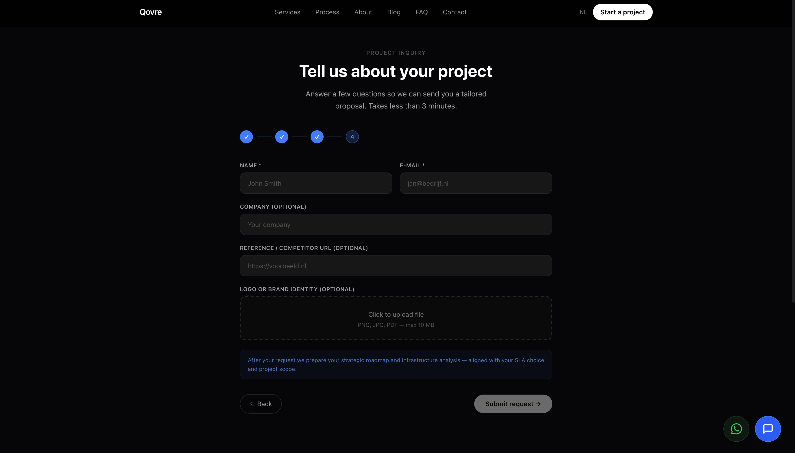
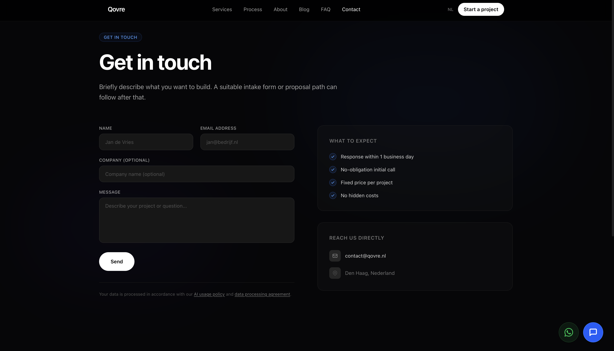

# Qovre Website

Qovre is a multilingual B2B website for a Dutch digital studio focused on websites, ecommerce, SaaS, AI automation, and technical SEO/GEO services. The project is built with Next.js App Router, localized with `next-intl`, and deployed on Vercel at [qovre.nl](https://qovre.nl).

## Highlights

- Multilingual marketing site with Dutch and English routes
- Service, process, industry, blog, and contact pages
- Guided multi-step project inquiry flow
- Admin area and API routes for lead handling
- Production deployment on Vercel with custom domains

## Tech Stack

- Next.js 16
- React 19
- TypeScript
- next-intl
- Supabase
- Resend
- Upstash Redis
- Vercel Analytics and Speed Insights

## Local Development

```bash
npm install
npm run dev
```

Open [http://localhost:3000](http://localhost:3000).

For a production build:

```bash
npm run build
npm run start
```

## Screens

### Homepage

Dutch landing page hero and primary navigation.



### Project Inquiry - Step 1

Service type selection in the intake flow.



### Project Inquiry - Step 2

Platform, page count, integrations, and CMS preferences.



### Project Inquiry - Step 3

Maintenance package and hosting preferences.



### Project Inquiry - Step 4

Contact details and asset upload for the final request step.



### Contact Page

Direct contact form and business contact details.



## Project Structure

```text
app/                  App Router pages, layouts, API routes
components/           UI and section components
data/                 SEO, blog, and case-study content
lib/                  Metadata, security, Supabase, utilities
messages/             Translation dictionaries
public/               Static assets and README screenshots
supabase/             SQL migrations and setup notes
tests/                End-to-end tests and reports
```

## Deployment

Production runs on Vercel and is available at:

- [qovre.nl](https://qovre.nl)
- [www.qovre.nl](https://www.qovre.nl)

## Notes

The README screenshots are stored in `public/screenshots/readme/` so they render both locally and on GitHub.
